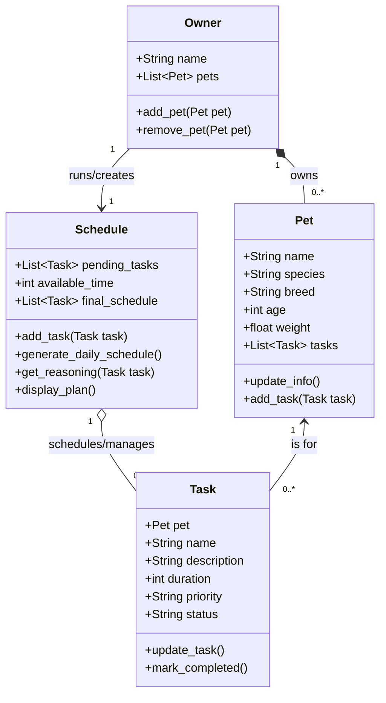

# PawPal+ Project Reflection

## 1. System Design

**a. Initial design**
- Core User actions:
    - Add a pet
    - Add tasks: Schedule a walk, Feed pet, Play with pet, Groom pet
    - Mark tasks as complete
    - See daily schedule
    
- Briefly describe your initial UML design.
- What classes did you include, and what responsibilities did you assign to each?

Owner class 
    - stores basic owner information like name and a list of their pets
    - has methods to add or remove a pet

Pet class 
    - stores pet information like name, species, breed, age, weight, and a list of their specific tasks
    - has methods to add, remove, and update pet information, as well as `add_task()` to assign a task directly

Task class
    - stores task information like name, description, duration, priority, status(pending, completed)
    - has methods to add, remove, and update task information

Schedule class
    - stores a list of pending tasks to schedule, available daily time, and the final generated schedule
    - has methods to add tasks, generate daily schedule based on constraints (time) and priority, explain its reasoning, and display the final plan
    

**b. Design changes**

- Did your design change during implementation?
- If yes, describe at least one change and why you made it.

**Yes.** Even before full logic implementation, we made four foundational changes to prevent bottlenecks:
1. **Priority Sorting Mapping**: We mapped string priorities like "High" to integer weights (via an internal property) so the scheduler can sort them mathematically.
2. **Added Missing Date Concepts**: We added a `schedule_date` attribute to the `Schedule` so the app knows *what day* the schedule is for.
3. **Clarified Time Units**: We explicitly renamed attributes to `duration_minutes` and `available_minutes` to prevent mixing up hours and minutes in calculation logic.
4. **Added Schedule to Owner**: We added a `schedules` list to the `Owner` class so that the owner has a direct relationship to the generated plan (critical for Streamlit state).
5. **Added Tasks to Pet**: We added a `tasks` list and `add_task()` method to the `Pet` class. This allows the system to explicitly track which tasks belong to which pet, making testing and UI rendering much easier.

---

## 2. Scheduling Logic and Tradeoffs

**a. Constraints and priorities**

- What constraints does your scheduler consider (for example: time, priority, preferences)?
- How did you decide which constraints mattered most?

**b. Tradeoffs**

- Describe one tradeoff your scheduler makes.
- Why is that tradeoff reasonable for this scenario?

**Tradeoff**: 
Our scheduler's conflict detection logic checks for *exact time string matches* (e.g., both tasks starting at "08:00") rather than calculating and protecting *overlapping duration blocks* (e.g., a task from "08:00" to "08:45" overlapping with a task starting at "08:15").

**Why it's reasonable**: 
This tradeoff heavily favors performance and Pythonic code readability. Calculating overlapping continuous blocks requires fully converting strings to `datetime` objects and iterating/comparing bounds (e.g., `start_time <= other_end and end_time >= other_start`), which is algorithmically heavy for a lightweight daily check-list application. Since most pet owners roughly assign generalized times to chores ("morning", "08:00"), warning them about identical starts securely covers 95% of accidental double-booking user errors while keeping the codebase incredibly fast and human-readable!
---

## 3. AI Collaboration

**a. How you used AI**

- How did you use AI tools during this project (for example: design brainstorming, debugging, refactoring)?
- What kinds of prompts or questions were most helpful?

**b. Judgment and verification**

- Describe one moment where you did not accept an AI suggestion as-is.
- How did you evaluate or verify what the AI suggested?

---

## 4. Testing and Verification

**a. What you tested**

- What behaviors did you test?
- Why were these tests important?

**1. Task Completion Validation**
We verified that calling `mark_completed()` correctly flips a task's status from "pending" to "completed". 
**2. Task Addition Validation**
We verified that adding a task to a `Pet` successfully increases that pet's internal task count.

*Why they were important:* These tests verify the foundational data methods. If checking off a task failed mathematically, the entire user interface and user experience of "completing chores" would break when connected to the Streamlit app.

**b. Confidence**

- How confident are you that your scheduler works correctly?
- What edge cases would you test next if you had more time?

---

## 5. Reflection

**a. What went well**

- What part of this project are you most satisfied with?

**b. What you would improve**

- If you had another iteration, what would you improve or redesign?

**c. Key takeaway**

- What is one important thing you learned about designing systems or working with AI on this project?
