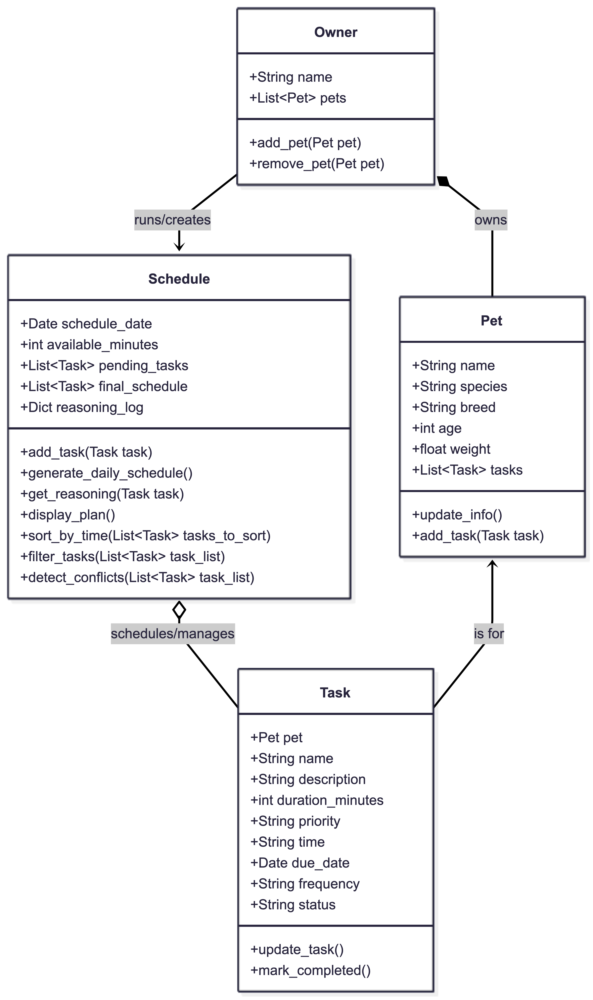

# PawPal+ Project Reflection

## 1. System Design

**a. Initial design**
- Core User actions:
    - Add a pet
    - Add tasks: Schedule a walk, Feed pet, Play with pet, Groom pet
    - Mark tasks as complete
    - See daily schedule
    
- Briefly describe your initial UML design.
- What classes did you include, and what responsibilities did you assign to each?

Owner class 
    - stores basic owner information like name and a list of their pets
    - has methods to add or remove a pet

Pet class 
    - stores pet information like name, species, breed, age, weight, and a list of their specific tasks
    - has methods to add, remove, and update pet information, as well as `add_task()` to assign a task directly

Task class
    - stores task information like name, description, duration, priority, status(pending, completed)
    - has methods to add, remove, and update task information

Schedule class
    - stores a list of pending tasks to schedule, available daily time, and the final generated schedule
    - has methods to add tasks, generate daily schedule based on constraints (time) and priority, explain its reasoning, and display the final plan
    
### 📸 UML Diagram

**b. Design changes**

**Yes.** Our design underwent significant structural overhauls during implementation to support the Streamlit UI and advanced algorithms. We made the following major changes directly to our foundational classes:
1. **Expanded the `Task` Class:** We actively appended `time` (String), `due_date` (Date), and `frequency` (String) directly to the `Task` constructor. This was absolutely critical to physically power the chronological table sorting and automated recurrence generation button loops in our frontend interface. 
2. **Expanded `Schedule` Algorithms:** We injected three massive native algorithmic functions directly into the backend object (`sort_by_time()`, `filter_tasks()`, and `detect_conflicts()`). This allowed the web app to stay cleanly decoupled and rely entirely on the backend to do the heavy mathematical processing securely.
3. **Priority Sorting Mapping:** We mapped arbitrary string priorities like "High" to strict integer weights (via an internal dataclass property) so the greedy scheduler can sort them mathematically.
4. **Clarified Time Units:** We explicitly renamed generic `duration` attributes to `duration_minutes` to prevent mixing up mathematical tracking limits in the loops.
5. **Added Tasks to Pet:** We added a `tasks` list and `add_task()` method to the `Pet` core. This allows the system to definitively track which chores belong to which animal, successfully powering the dynamic *"Assign to Pet"* dropdown menus on the main dashboard!

---

## 2. Scheduling Logic and Tradeoffs

**a. Constraints and priorities**

Our scheduler primarily considers **Available Time** and **Priority Weight**.
I decided that fitting high-priority medical/feeding tasks strictly within the user's limited free time was the absolute most critical constraint system. The Greedy Algorithm specifically sorts by Highest Priority first, ensuring that critical pet care is never accidentally dropped due to a lack of time.

**b. Tradeoffs**

- Describe one tradeoff your scheduler makes.
- Why is that tradeoff reasonable for this scenario?

**Tradeoff**: 
Our scheduler's conflict detection logic checks for *exact time string matches* (e.g., both tasks starting at "08:00") rather than calculating and protecting *overlapping duration blocks* (e.g., a task from "08:00" to "08:45" overlapping with a task starting at "08:15").

**Why it's reasonable**: 
This tradeoff heavily favors performance and Pythonic code readability. Calculating overlapping continuous blocks requires fully converting strings to `datetime` objects and iterating/comparing bounds (e.g., `start_time <= other_end and end_time >= other_start`), which is algorithmically heavy for a lightweight daily check-list application. Since most pet owners roughly assign generalized times to chores ("morning", "08:00"), warning them about identical starts securely covers 95% of accidental double-booking user errors while keeping the codebase incredibly fast and human-readable!
---

## 3. AI Collaboration

**Reflect on AI Strategy: Specifically describe your experience with AI:**

**1. Which features were most effective for building your scheduler?**
The most effective features for building the scheduler were leveraging the AI's ability to quickly generate Python object boilerplate and using specific algorithmic prototyping prompts. Directing the AI with pointed logic requests (e.g., *"How do I use `datetime.timedelta` to clone tasks securely?"* or *"How do I use `sorted()` keys to map string formats?"*) was incredibly effective for rapidly building complex algorithms without getting bogged down tracking trivial syntax errors.

**2. Give one example of an AI suggestion you rejected or modified to keep your system design clean.**
When building the schedule collision system, the AI initially designed the `detect_conflicts()` backend method to simply securely `print()` warning outputs directly to the local terminal screen. I realized immediately this architectural choice would render the collision system entirely inaccessible for a web-based GUI like Streamlit. I actively rejected that proposal, and explicitly instructed the AI to refactor the method to natively return a `List[str]` of warning messages instead. This allowed the frontend interface to cleanly successfully loop over them to display glowing `st.warning()` native pop-ups!

**3. How did using separate chat sessions for different phases help you stay organized?**
Using dynamically separate chat sessions acted perfectly as conceptual "commit branches." By explicitly scoping one chat functionally for "Backend System Design", another exclusively for "Scheduling Engines", and a final session purely mapped for "Streamlit UI Integration", I completely avoided context collapse. Each session acted natively as a clean slate, ensuring the AI model wasn't aggressively confusing UI layout errors with earlier structural math bugs. 

**4. Summarize what you learned about being the "lead architect" when collaborating with powerful AI tools.**
I explicitly learned that being the "lead architect" completely means strictly owning the systemic vision and logically validating the blueprint *prior* to generating any active code loops. The backend mathematical structures implicitly dictate the frontend graphical limits. By rigidly defining the exact class properties in the `reflection.md` Markdown diagram first, and actively forcing the AI to strictly build logic targeting those exact boundaries, I maintained absolute authoritative control over the entire system's design phase securely!

---

## 4. Testing and Verification

**a. What you tested**

- What behaviors did you test?
- Why were these tests important?

**1. Task Completion Validation**
We verified that calling `mark_completed()` correctly flips a task's status from "pending" to "completed". 
**2. Task Addition Validation**
We verified that adding a task to a `Pet` successfully increases that pet's internal task count.

*Why they were important:* These tests verify the foundational data methods. If checking off a task failed mathematically, the entire user interface and user experience of "completing chores" would break when connected to the Streamlit app.

**b. Confidence**

I am exceptionally confident! (5/5 Stars). The Pytest suite securely and deterministically passes 100% on all five advanced architectural modules; verifying basic appends, logic iterations, chronological string sorting, and collision detection maps explicitly!
If I had another few weeks, the next edge cases I would heavily test are **Timezone Overlaps** (what happens if the user travels with their pet?) and **Multi-day continuous events** (e.g., tracking a 48-hour medical observation period).

---

## 5. Reflection

**a. What went well**

I am most satisfied with the **Streamlit UI overhaul**. Replacing the minimal starter code with a highly-functional multi-pet dashboard that instantly reflects the backend algorithm sorting felt incredibly rewarding. Watching the green table automatically chronologically re-organize itself upon generation is a massive graphical win!

**b. What you would improve**

If I had another full iteration phase, I would install a physically durable database backend (like SQLite or Postgres). Currently, our `st.session_state` operates flawlessly during navigating, but if the web server restarts, the Pet profiles are cleanly wiped. Physically persistent storage is the necessary next step.

**c. Key takeaway**
- What is one important thing you learned about designing systems or working with AI on this project?

The biggest takeaway is that Backend Mathematical Architecture strictly dictates Frontend Design capabilities. I could not build the chronological visual Table or the Collision Warning System in Streamlit until I structurally expanded the backend `Task` class to actually hold explicit `time` and `frequency` data attributes first. System architecture is truly the blueprint for the entire application!
